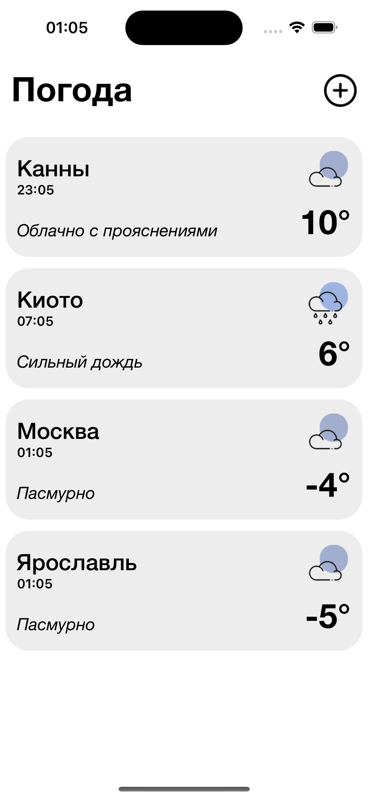
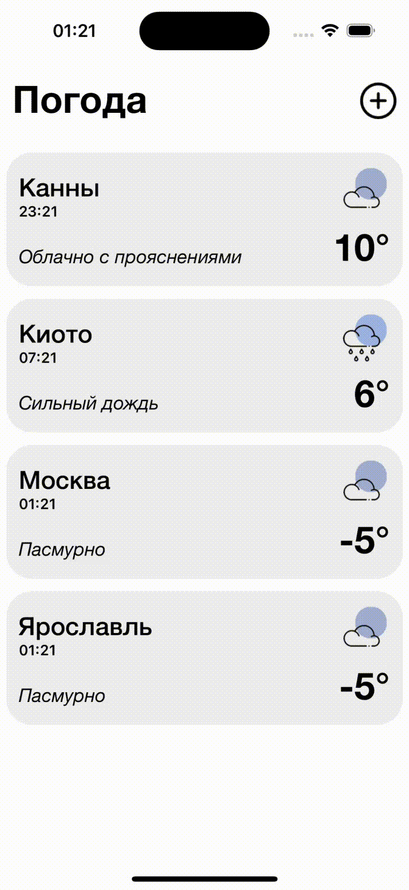
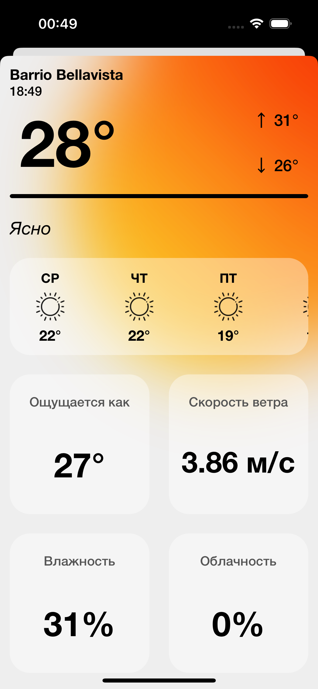
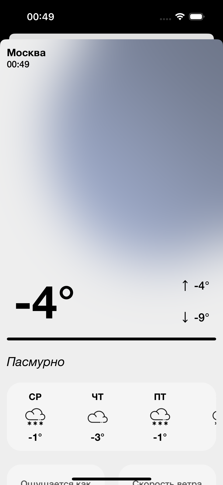

# Weather App Project
Клиент-серверное приложение на основе OpenWeatherMap API для отслеживания погоды.

## Содержание
- Технологии
-  Начало работы
-  Возможности

## Технологии
- UIKit
- Alamofire
- SnapKit
- PinLayout
- GCD
- Architecture: VIPER

## Начало работы

Клонировать репозиторий в нужную папку с помощью команды:
```
git clone git@github.com:evgeniasmirnova/WeatherProject.git
```

## Возможности


### Главный экран
На данном экране присутствует список избранных городов (по умолчанию их четыре: Канны, Киото, Москва и Ярославль), в которых пользователь хочет отслеживать погоду, их локальное время и основная информация о состоянии погоды. 
Список сохраняется даже после перезапуска, сбрасывается только при удалении приложения. Предусмотрено удаление и добавление новых городов.



#### Добавление элемента на главный экран
По нажатию на кнопку плюс можно добавить новый город на главный экран. На экране выбора города можно воспользоваться поиском.


#### Удаление элемента с главного экрана
В программе предусмотрено удаление города посредством свайпа ячейки.



### Экран детальной информации о погоде 
Здесь отображена информация о погоде на 5 дней, ощущение температуры, скорость ветра, влажность, облачность. 
Для удобства название города и время в его часовом поясе закрепляется при скролле — так вы их не потеряете.

   
